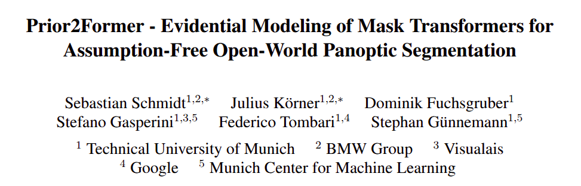

# Prior2Former - Evidential Modeling of Mask Transformers for Assumption-Free Open-World Panoptic Segmentation

This is the official implementation of "Prior2Former - Evidential Modeling of Mask Transformers for Assumption-Free Open-World Panoptic Segmentation",
by Sebastian Schmidt*, Julius Körner*, Dominik Fuchsgruber, Stefano Gasperini, Federico Tombari, Stephan Günnemann presented at IEEE International Conference on Computer Vision (ICCV), 2025.



[Project Page](https://www.cs.cit.tum.de/daml/prior2former/)

## Project Structure
For Running the Training of Prior2Former all necessary code is in the Prior2Former Folder
In Benchmarks, all Code for SMIYC, OoDIS and PANIC is present. These can have different requirements 

## Setup environment
The Codebase is using Pytorch Lightning, you can install it with the requirements or use the yaml for conda.
```bash
pip install Prior2Former/requirements/requirement.txt
```

## Training
In general we use Pytorch lightning for training. For this we run a command similar to, which illustrates the usage of the run script
```bash
python Prior2Former/start_prior2former.py --config-path Prior2Former/Config/yaml/mask2former/cityscapes/config_softmax_prototype_beta.yaml --datamodule.args.batch_size=16 --trainer.gpus=2 --experiment_name SomeName 
```
we give a config as yaml file, based on the position of the yaml file a default dataclass is loaded. Here the default dataclass would be at
```bash
Prior2Former/Config/dataclass/mask2former/cityscapes/default_config.py
```
where the yaml is replaced with dataclass in the path. The Yaml file overrides the dataclass. Lastly, commandline arguments can be parsed to overwrite the yaml. The commandline arguments and the yaml configurations must be present in the dataclass. The experiment_name is the name that is used for logging losses and other metrics to MLFlow and Tensorboard. 

Not that here the file structure for the configs is slightly different, so you need to include the yaml folder  and the CornerCases folder in the path.

In the following bash, we show the commands for running P2F and U3HS. Note that if you check the configs, you can select the dataset, by selecting the yaml config within that dataset folder:
```bash
#P2F
python Prior2Former/start_prior2former.py --config-path Prior2Former/Config/yaml/mask2former/cityscapes/config_softmax_prototype_beta.yaml --datamodule.args.batch_size=2
```


Due to a recent cleanup and refactoring some parts might have wrong references, we will continue testing an fixing the code, if you encounter any issues feel free to contact us.